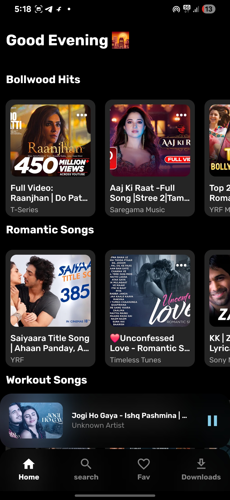
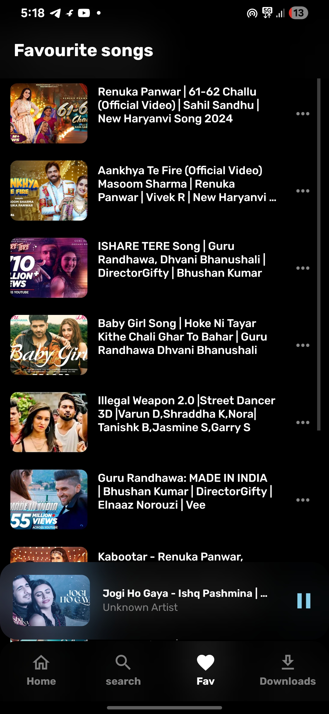
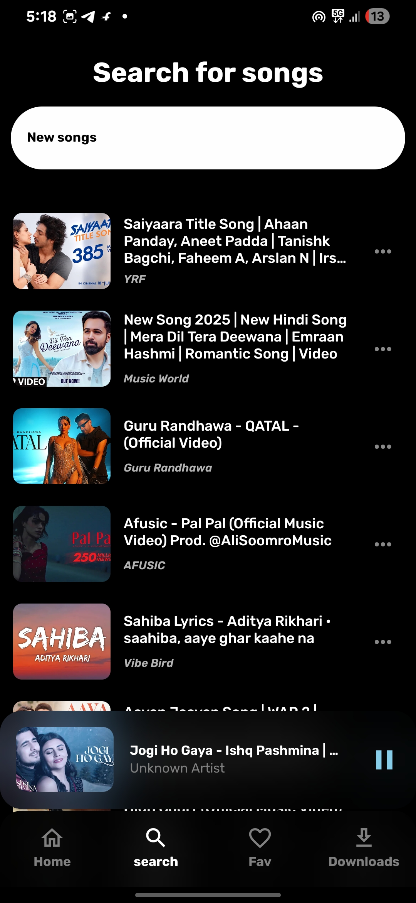

#  Beatly – Music Streaming App

**Beatly** is a modern music streaming application built with React Native.  
It lets you search, stream, and manage music from YouTube directly in your mobile device with a clean and intuitive interface.


<p align="center">
  
  
  
  
</p>


---

## 🚀 Features
- 🎶 Stream high-quality audio directly from YouTube
- 🔍 Search your favorite songs and artists
- 📃 Repeat Mode
-  ♥ add to fav (maintains local Database)
- 📱 Built with React Native for Android (ios will be support later)
- ⚡ Optimized for fast performance
- support fast downloading for offline listening


## 📦 Tech Stack
- **React Native** – Cross-platform mobile framework
- **onlynativetube** – Custom library for YouTube audio streaming
- **Realm** - for local database
- **JavaScript / TypeScript**

---


## 📥 Installation


```bash
git clone https://github.com/sonu36437/beatly.git
cd beatly
npm install
npm start
